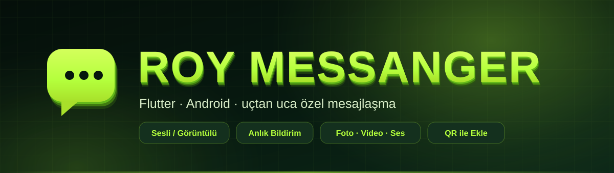

<div align="center">



<br>


[](https://github.com/cohard32/kardes_mesaj/releases/latest)
[](https://github.com/cohard32/kardes_mesaj/releases)


**Aile içi kullanım için yazılmış, reklamsız ve takipsiz bir Android mesajlaşma uygulaması.**

</div>

---

## Ne yapar

<table>
<tr>
<td width="33%" valign="top">

### Mesajlaşma
Anlık metin · mesaja yanıt (alıntı) · ✓✓ görüldü · yazıyor göstergesi · emoji tepkileri · GIF & sticker · ilk 60 saniye içinde mesaj silme

</td>
<td width="33%" valign="top">

### Arama
Sesli ve görüntülü arama · kilit ekranında tam ekran gelen arama · özelleştirilebilir zil sesi · meşgul bildirimi (uygulama arka plandayken de) · kopan bağlantıda otomatik kapanma

</td>
<td width="33%" valign="top">

### Medya
Fotoğraf ve video **orijinal kalitede** · sesli mesaj (dalga formu, hız, seek) · galeriye indirme · videolar dokununca yüklenir

</td>
</tr>
<tr>
<td valign="top">

### Sosyal
`@kullanıcı adı` ile arama · QR kod ile ekleme · arkadaşlık istekleri · profil & durum · engelleme

</td>
<td valign="top">

### Bildirim
Uygulama kapalıyken bile anlık push · özelleştirilebilir bildirim sesi · titreşim ayarı · sohbet sessize alma¹ · pil optimizasyonu rehberi

</td>
<td valign="top">

### Bakım
Onaylı uygulama içi güncelleme (sürüm notlarıyla) · uzaktan teşhis raporlama · 5 tema

</td>
</tr>
</table>

<sub>¹ Sessize alma, gizlilik gereği yalnız <a href="sunucu/aktarici">aktarıcılı</a> derlemede görünür.</sub>

---

## Tasarım

Beş tema, uygulama yeniden başlamadan **Ayarlar → Görünüm**'den değişir: **Neon Lime** (varsayılan, aşağıda), AMOLED Gece, Gün Işığı (açık), Yüksek Kontrast, Lavanta Gece. Tüm renkler [`lib/tema.dart`](lib/tema.dart) içinde merkezîdir; her temanın metin kontrastı WCAG AA'ya göre testle denetlenir (`test/tema_test.dart`).

<div align="center">

|  |  |  |  |  |
|:--:|:--:|:--:|:--:|:--:|
| `#050F0A` | `#071A10` | `#0D2818` | `#63B81A` | `#B4FF3C` |
| zemin derin | zemin | yüzey | yeşil | neon |

</div>

---

## Nasıl çalışır

```
Flutter (Dart)
├── Firebase Auth ............ e-posta/şifre girişi, e-posta doğrulama
├── Cloud Firestore .......... mesajlar, sohbetler, arkadaşlıklar, arama sinyalleşmesi
├── FCM (HTTP v1) ............ anlık bildirim + gelen arama tetikleyicisi
├── Firebase App Check ....... sahte istemci koruması (Play Integrity)
├── Agora RTC ................ sesli/görüntülü arama
├── CallKit Incoming ......... kilit ekranı gelen arama arayüzü
├── Cloudinary ............... medya barındırma
└── Aktarıcı (isteğe bağlı) ... Cloudflare Worker: FCM gönderimi + Agora token'ı
                                (sırlar APK'da değil sunucuda — sunucu/aktarici)
```

Sohbet, arkadaşlık ve arama kayıtları **aynı deterministik kimliği** paylaşır: iki kullanıcı kimliği sıralanıp birleştirilir. Böylece "bu iki kişi arkadaş mı" sorusu tek bir doküman kontrolüne iner.

> Cloud Functions **yok**: proje bilinçli olarak Firebase'in ücretsiz Spark planında, kredi kartı gerektirmeden çalışacak şekilde tasarlandı. İsteğe bağlı [aktarıcı](sunucu/aktarici) da Cloudflare'in ücretsiz katmanında (kartsız) çalışır; derlemede `--dart-define=AKTARICI_URL=...` verilmezse uygulama onsuz çalışır.

---

## Güvenlik

Veriye erişim tamamen [`firestore.rules`](firestore.rules) tarafından belirlenir; istemcideki hiçbir kontrol güvenlik sayılmaz.

- Sohbet ve mesajlar yalnızca o sohbetin katılımcılarına açık
- Mesaj göndermek arkadaşlık gerektirir; engelleme her iki yönü de kapatır
- Mesaj silme süresi **sunucuda** doğrulanır — istemci saatine güvenilmez
- Arama kanalı bilgisi yalnızca o çiftin üyelerine görünür; kanal adları 128 bit rastgele
- Belge kimlikleri (arkadaşlık, sohbet, engel, istek) içindeki kullanıcılardan türetilmiş olmak zorunda — kimlik sahteciliğiyle onaysız arkadaşlık / sahte engel kurulamaz
- Bildirim token'ı ve sessize alınan sohbetler yalnız sahibinin okuyabildiği `users/{uid}/ozel` belgesinde

Kurallar `@firebase/rules-unit-testing` ile emülatörde **97 senaryo** üzerinden sınanır: hem yetkisiz erişimin reddedildiği, hem de meşru kullanımın çalışmaya devam ettiği test edilir.

```bash
firebase emulators:exec --only firestore --project demo-x "node firestore_rules_test.mjs"
# → 97 PASS / 0 FAIL
```

---

## Kurulum

<div align="center">

[](https://github.com/cohard32/kardes_mesaj/releases/latest)

</div>

Uygulama zaten kuruluysa yeni sürümü kendisi bulur — **Ayarlar → Güncellemeleri kontrol et**.

### Kaynaktan derleme

```bash
flutter pub get
flutter build apk --release --target-platform android-arm64
# aktarıcıyla: ... --dart-define=AKTARICI_URL=https://roy-aktarici.<hesap>.workers.dev
```

Yayın öncesi yapılacaklar (kural yayını, imza anahtarı, aktarıcı): **[docs/YAYIN_ADIMLARI.md](docs/YAYIN_ADIMLARI.md)** · Analiz raporu: [docs/ANALIZ_RAPORU.md](docs/ANALIZ_RAPORU.md)

Derleme için gerekli ama depoda **bulunmayan** dosyalar (hepsi `.gitignore`'da):

| Dosya | İçerik |
|---|---|
| `lib/gizli.dart` | Agora App Certificate |
| `assets/service_account.json` | FCM HTTP v1 gönderim kimliği (aktarıcıya geçince kaldırılır) |
| `android/key.properties` | Sürüm imza anahtarı (`storeFile`, `storePassword`, `keyAlias`, `keyPassword`) |

`android/app/google-services.json` depodadır (Firebase istemci yapılandırması gizli değildir; API anahtarını GCP'de Android uygulamasına kısıtlayın — bkz. YAYIN_ADIMLARI §5).

---

## Sürüm geçmişi

| Sürüm | Öne çıkanlar |
|---|---|
| **1.9.0** | Güvenlik kuralları sertleştirmesi (7 açık) · mesaja yanıt · sohbet sessize alma · 5 tema · kaymayan sohbet listesi · arka planda meşgul tespiti · onaylı güncelleme · aktarıcı · CI |
| 1.8.0 | Engelleme · e-posta doğrulama · şifre gücü · App Check · gizlilik sıkılaştırması |
| 1.7.0 | Mesaj silme (60 sn) · orijinal kalitede medya · galeriye indirme |
| 1.6.x | Görüntülü arama kararlılığı · zil sesi kök neden düzeltmesi · uzaktan teşhis |
| 1.5.x | Yeni tema · arama düzeltmeleri · sohbet içi arama |
| 1.4.x | Bildirim sesi özelleştirme · otomatik güncelleme |
| 1.0–1.3 | Mesajlaşma · medya · sesli mesaj · emoji & GIF · arama altyapısı |

Ayrıntı için [Releases](https://github.com/cohard32/kardes_mesaj/releases).

---

<div align="center">
<sub>Kişisel kullanım için geliştirildi · <b>Flutter</b> ile yazıldı</sub>
</div>
